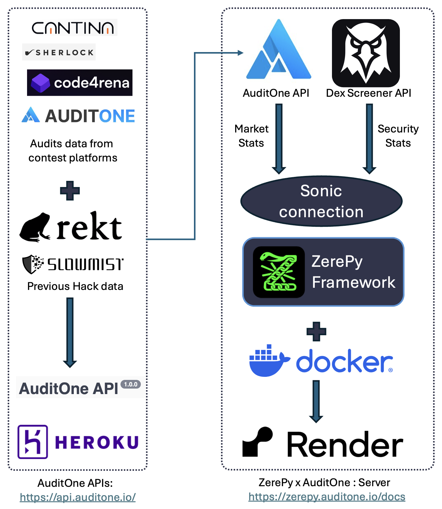

# **DeFi-Sentinel: Automated Risk Assessment and Portfolio Optimization**

## **Overview**
DeFi-Sentinel is a **DeFi risk monitoring and portfolio optimization tool** built using the **ZerePy Framework**. It integrates with **AuditOne API, Dex Screener API, and historical hack data sources** to provide **automated risk assessments, security insights, and portfolio rebalancing**.



## **Features**
- **Automated security analysis** using the AuditOne API.
- **Token security and market data retrieval** from multiple sources.
- **Portfolio optimization** based on security scores and DeFi risk metrics.
- **Automated swaps and risk-based trading** using smart contract interactions.
- **Modular architecture** for easy customization and deployment.

---

## **Project Structure**

### **Assessment Module (`assessment/`)**
- `agent_choice.py` – Selects the projects for security reporting based on risk metrics.
- `calculation.py` – Performs risk analysis and portfolio calculations.

### **Core Functions (`core/`)**
- `fetch_security_stats.py` – Retrieves security data from the AuditOne API.
- `fetch_token_stats.py` – Fetches real-time token market statistics.
- `fetch_tvl(future).py` – Collects total value locked (TVL) data.
- `fetch_user_tokens.py` – Retrieves user token holdings and portfolio distribution.
- `generate_report.py` – Generates security assessment reports.
- `optimise_portfolio.py` – Rebalances portfolios based on security scores.

### **Additional Components**
- `scripts/` – Automation scripts for batch processing.
- `static/` – Static assets such as CSS and JavaScript.
- `templates/` – HTML templates for the Flask frontend.
- `utils/` – Utility functions and helper modules.
- `venv/` – Virtual environment for dependency management.
- `.env` – Stores environment variables.
- `app.py` – Main application logic (Flask API and web interface).
- `LICENSE` – Licensing information.

---

## **Installation & Setup**
### **Prerequisites**
- Python 3.11+
- MongoDB

### **Installation**
```bash
# Clone the repository
git clone https://github.com/yourusername/defi-sentinel.git
cd defi-sentinel

# Create and activate virtual environment
python3 -m venv venv
source venv/bin/activate  # On Windows use: venv\Scripts\activate

# Install dependencies
pip install -r requirements.txt
```

### **Environment Variables**
Create a `.env` file in the project root and configure it as follows:
```ini
SONIC_API_KEY=your_api_key
MONGO_URI=mongodb://localhost:27017/defi_sentinel
```

### **Run the Application**
```bash
python app.py
```
Access the web interface at **`http://localhost:5000`**.

---

## **API References**
- **AuditOne API:** [https://api.auditone.io/](https://api.auditone.io/)
- **ZerePy Documentation:** [https://zerepy.auditone.io/docs](https://zerepy.auditone.io/docs)
- **Sonic's Risk Watch:** [https://sonic.auditone.io](https://sonic.auditone.io)

---

## **Contributions**
We welcome contributions! Please follow these steps:
1. **Fork the repository** on GitHub.
2. **Create a new branch** for your feature or bug fix.
3. **Commit your changes** and push to your forked repository.
4. **Submit a pull request** to the main repository.

For major changes, please open an issue first to discuss the proposed modification.

---

## **License**
This project is licensed under the **MIT License**.
