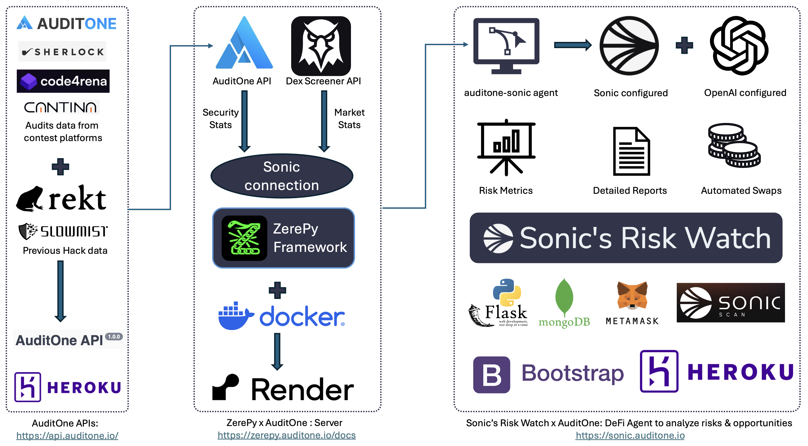

### **Sonic's Risk Watch - ZerePy Framework Documentation**

#### **Overview**
Sonic's Risk Watch, built on the ZerePy framework from the Blorm Network, is developed for automated risk assessment and DeFi security monitoring and perform actions to maintain users portfolio optimised to security. It integrates with AuditOne and market data sources to provide **real-time risk metrics, automated swaps, and advanced security insights**.

#### **ZerePy Framework in Sonic's Risk Watch**
ZerePy serves as the **core processing engine** for Sonic's Risk Watch, enabling:

- Secure API integrations with **AuditOne Security Stats API** and **Dex Screener Market Data**.

- Automated **portfolio rebalancing and risk-based swap execution**.

- A modular architecture that allows **scalable risk assessment and DeFi security automation**.

#### **System Architecture**

##### **Data Sources**
- **AuditOne API**: Provides **security stats** from audit contest platforms such as AuditOne, Sherlock, Code4rena, and Cantina.
- **Rekt & SlowMist**: Supplies **historical hack data** for risk assessment.
- **Dex Screener API**: Fetches **real-time token market stats**.

##### **Processing and Automation**
- The **Sonic connection** on ZerePy is coded with logic to integrate security and market data
- **ZerePy Framework** runs **automated security evaluations** based on the received data.
- **Auditone-sonic agent** executes **automated portfolio rebalancing** and performs **automated swaps**.
- **Deployed using Docker and Render**.

##### **Key Features**
- **Automated Risk Metrics and Reports**
- **Configurable Agent flows to execute automated swaps to optimise security**
- **Market-driven Portfolio Optimization**
- **Automated Swap Execution with targeted security score**
- **DeFi Application Stack**:
  - Backend: **Flask, MongoDB**
  - Frontend: **Bootstrap**
  - Wallet Integration: **Metamask**
  - Blockchain Data: **SonicScan**
  - Cloud Deployment: **Heroku, Render**

#### **Enhancements in Sonic's Risk Watch**
- **AuditOne Security Stats API added to Sonic Connection**
- **Token stats now include real-time market data from Dex Screener**
- **Improved automation for risk-based DeFi trading strategies**

#### **Documentation and API References**
- **AuditOne API**: [https://api.auditone.io/](https://api.auditone.io/)
- **ZerePy Server API Docs**: [https://zerepy.auditone.io/docs](https://zerepy.auditone.io/docs)
- **Sonic's Risk Watch**: [https://sonic.auditone.io](https://sonic.auditone.io)

This documentation outlines the role of **ZerePy** in powering Sonic's Risk Watch, with a focus on **secure, automated DeFi risk management and swap execution**.